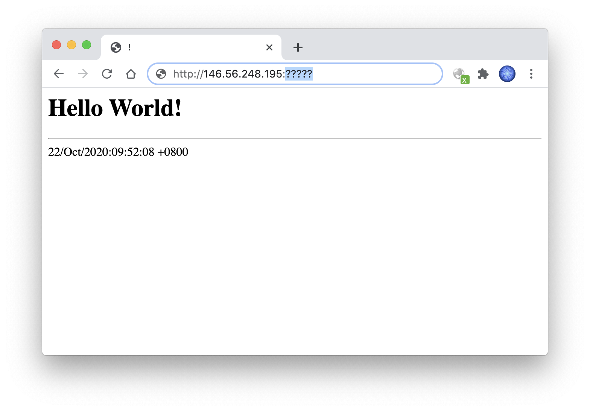

# 使用 iptables 防止端口扫描

## 快速使用

```bash
./install.sh
```

注意运行前先配置公开端口，默认已加入 22 端口（建议使用随机端口作为管理端口）。


## 原理和实现

如何拦截端口扫描？其实有个简单的思路：布置陷阱。我们随机监听一些未使用的端口，假如有 IP 在短时间内前来连接好几个，那么很可能就是扫描者。于是可临时屏蔽该 IP 所有流量，保护那些还未被扫到的端口。

这个思路很简单，但如何让实现也简单？如果使用普通 socket 监听端口，那么扫描者可根据连接成功信息，陆续获得陷阱端口号，之后就可以避开这些端口，一段时间后即可完全破解。因此，陷阱需要在底层实现。

使用 raw socket 或 libpcap 倒是可以，不过需要写点代码。况且这两者只能接收包，无法拦截包。要简单的实现拦截，还得把 IP 扔给 iptables/ipset 去处理。这需要频繁和内核交互，浪费资源。

那么，能不能让接收和拦截都由 iptables 实现？


## 动态黑名单

事实上 iptables 非常强大，除了常用的功能，还有丰富的 [扩展模块](http://ipset.netfilter.org/iptables-extensions.man.html)。

这次要介绍的，是一个可以在运行时动态增删 ipset 的模块：`SET`。它的用法很简单，例如：

```bash
iptables 匹配条件 -j SET --add-set ip-set-xxx src
```

通过它，即可将 iptables 匹配到的包的源 IP 直接添加到 ipset，无需自己实现交互，简单并且高效！

我们来尝试一下。首先创建一个名为 `scanner-ip-set` 的集合，用于存放扫描者的 IP：

```bash
ipset create scanner-ip-set hash:ip
```

我们假设保护 12345 端口，因此对任何尝试连接非 12345 的 IP 都当做扫描者，添加到黑名单里：

```bash
iptables \
  -A INPUT \
  -p tcp --syn ! --dport 12345 \
  -j SET --add-set scanner-ip-set src
```

我们来验证下，每隔 1 秒列出 `scanner-ip-set` 表：

```bash
watch -n1 \
  ipset list scanner-ip-set
```

当我们使用另一台设备连接非 12345 端口时，该设备的 IP 出现在黑名单里了！

接下来，我们实现拦截的功能。


## 拦截流量

需要注意，我们得拦截两种包：

* 拦截扫描者连接 **陷阱** 端口（IP 添加到黑名单之前）

* 拦截扫描者连接 **任何** 端口（IP 添加到黑名单之后）

如果不拦截第 1 种，扫描者的 SYN 包可能会触发系统回复 RST 包，这在使用云主机的场合下，会暴露云防火墙开放的陷阱端口，细节后面讨论。

至于实现是非常简单的，这里大致表示下。拦截第 1 种：

```bash
iptables \
  -A INPUT \
  -p tcp --syn ! --dport 12345 \
  -j DROP
```

拦截第 2 种：

```bash
iptables \
  -A INPUT \
  -p tcp --syn \
  -m set --match-set scanner-ip-set src \
  -j DROP
```

现在，当我们连接非 12345 端口之后，该设备其他任何端口都无法连接了！

> 使用 `ipset flush scanner-ip-set` 可清空黑名单。推荐在本地虚拟机上试验，不要远程试验~


## 过期和累计

即便确定是扫描者，IP 也不能永远拉黑。长时间拉黑意义并不大，扫描者可以重新拨号不断换 IP，反而我们可能将之后分到这些 IP 的正常用户给屏蔽了。

因此我们在创建 ipset 时需要加上过期时间，例如 30 秒：

```bash
ipset create scanner-ip-set hash:ip timeout 30
```

现在展示黑名单时，每条记录都有 `timeout` 参数。该值每秒自动 -1，到 0 记录就删除了。

如果某 IP 在过期时间内又出现，那么是重置定时器，还是保持原先倒计时？

默认是不重置的。如果希望重置，可参考 `SET` 模块的 `--exist` 选项。

----

此外，在本文开头也提到「IP 短时间内前来连接好几个」，而在上述实现中，只要连接一个陷阱端口 IP 就拉黑了，这也许太过苛刻。

因此，我们需要加上统计功能。可以通过 ipset 的 `counters` 选项实现：

```bash
ipset create scanner-ip-set hash:ip timeout 30 counters
```

现在展示黑名单时，每条记录又多了 `packets` 和 `bytes` 参数。每当包匹配成功时，参与过的 set 记录的 `packets` 累加 1，`bytes` 累加包长度。

那么，怎样才能读取 `packets` 然后做比较？这需要另一个选项 `--packets-gt`。

我们将该条件加在上述第 2 种拦截（拦截所有端口）中，例如：

```bash
iptables \
  -A INPUT \
  -p tcp --syn \
  -m set --match-set scanner-ip-set src \
  --packets-gt 5 \
  -j DROP
```

这样，只有当某 IP 在过期时间内访问 5 次以上陷阱端口时，才会进行拦截。策略相对宽松了一些。

这个值可根据当前风险状况进行调整。例如在被很多 IP 扫描时，可以降低一些。

> 上述提到的这些功能，事实上用 `-m recent` 也能实现，甚至更简单。当然本文主要介绍的 `-j SET` 灵活性更高一些。


## TCP 状态

在上述两种拦截中，我们都只针对 SYN 包，为什么不是所有包？

在第 2 种拦截（所有端口）中，只针对 SYN 可以让已建立的 TCP 连接不受影响。当然这个策略可根据实际情况调整。

在第 1 种拦截（陷阱端口）中，如果拦截所有包，那么服务器对外的连接可能会受到影响，如果本地端口正好和陷阱端口相同，对方 IP 就进黑名单了。

----

不过第 1 种情况仍存在问题：假如扫描者不用 SYN 而是用 ACK 进行探测，那么系统会回复 RST 包，导致端口暴露。

因此我们还得通过连接跟踪，将非 SYN 的异常包进行拦截：

```bash
iptables \
  -A INPUT \
  -p tcp ! --syn \
  -m conntrack ! --ctstate ESTABLISHED \
  -j DROP
```


## 云防火墙

使用云主机时，通常会用到厂商提供的防火墙，例如只开放使用的端口，其他端口都屏蔽。

然而这会导致陷阱端口失效，因此我们需要开放一定数量的端口。这个数量不能太少，否则安全性会降低。

假如开放 100 个随机端口，那么主机每收到 1 个陷阱包，意味着扫描者其实发送了 655.36 个，其中绝大部分都被云防火墙丢弃了。如果没有云防火墙，这个 IP 早被判定为扫描者了；但现在只收到 1 个，甚至还没达到拦截计数器的阈值。因此有些策略需要进行调整。

例如，可以在需要保护的端口前后埋设陷阱。假设保护 12345 端口，那么我们可放行 12340 - 12350 端口，如果扫描器发送的端口号是线性的话，无论递增还是递减，都可以大概率提前落入陷阱。

**需要注意的是，陷阱端口必须足够随机，以防被猜中。如果攻击者知道陷阱端口号，就可以将源 IP 伪造成正常用户故意踩陷阱，从而导致正常用户被拉黑无法访问。** 因此，最好通过云防火墙 API 定期修改陷阱端口。（当然攻击者即使不知道陷阱端口，也可以通过发送很多包，把正常 IP 拉黑，只是效率较低。这个问题之后再写文讨论）

云防火墙虽然用起来比较麻烦，每个厂商的 API 也都不同，但它有个很大的优点：被拦截的流量不占带宽。这对安全防护很有用。即使有超大的扫描流量，我们的服务器也不受影响。


## 延迟反馈

假如我们要保护 80 端口，但扫描者发的第一个包就是 80，那么是不是就没办法了？

如果扫描器在短时间里发送了多个包，这种情况仍有解决方案：延迟反馈。

当我们收到 80 端口的 SYN 包时，不立即放行到系统，而是先延迟一会。假如在这段时间内，该 IP 命中了其他的陷阱端口，那么将延迟队列里的 80 SYN 删除，这样就可以防止首次猜中的情况！

至于延迟多少，取决于安全和性能的平衡。当然，如果扫描器发包很慢的话，这种方案未必奏效。

至于实现，目前暂未研究。iptables 似乎没有延迟的功能，而 tc 命令只能延迟发送的包，看来需要一些奇技淫巧才能简单实现~


## 端口集合

前面为了简单表示，我们使用 12345 端口，但现实中端口也许不止一个，并且可能不断变化。

如果端口变一次 iptables 就得改一次，显然很累赘。因此不妨将端口也放在 ipset 里：

```bash
ipset create pub-port-set bitmap:port range 0-65535

iptables \
  -A INPUT \
  -p tcp --syn \
  -m set ! --match-set pub-port-set dst \
  -j SET --add-set scanner-ip-set src
```

之后我们只需操作 `pub-port-set` 集合即可：

```bash
ipset add pub-port-set 12345
```


## 完整实现

综上所述，整理了一个相对完整的版本：

https://github.com/EtherDream/anti-portscan/blob/master/install.sh

由于写的比较仓促，如果存在问题请及时指出，有更好的思路也可以交流~


## 在线演示

可以试试多久找出这个 HTTP 端口？

https://etherdream.com:?????



<details>
<summary>查看答案：</summary>
  <details>
  <summary>确定查看？</summary>
  https://etherdream.com:39172
  </details>
</details>